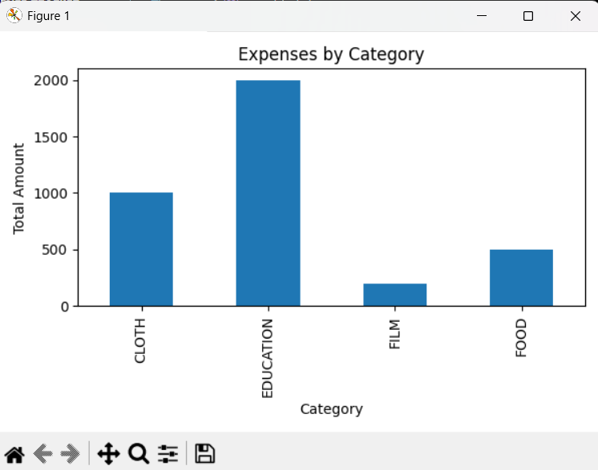

# Expense Tracker (Desktop)

A simple desktop expense tracker built with Python, Tkinter, SQLite, Pandas and Matplotlib.

## Features

- Add, update and delete expenses (amount, category, date, note).
- Select categories from a dropdown and add new categories.
- View all expenses in a list.
- See total amount spent per category as a bar chart.

## Tech Stack

- Python
- Tkinter (GUI)
- SQLite (database)
- Pandas, Matplotlib (reports)

## How to Run

python -m venv .venv
..venv\Scripts\activate
pip install -r requirements.txt
python app.py

## if error in venv 

Set-ExecutionPolicy -Scope Process -ExecutionPolicy Bypass
.venv\Scripts\activate

## Screenshots

_Main window_

_Category report_

